# DAG dos Objetos de Conhecimento

- Fonte: [objetos_de_conhecimento.pdf](/Users/yzhlu/Documents/PHD/2026-1/PPGEEC2327_-_topicos_4_-_T01/enem/objetos_graphify/objetos_de_conhecimento.pdf)
- Categorias: 5
- Objetos únicos: 35
- Arestas do DAG: 41

## Estrutura

```mermaid
flowchart TD
  root["Matemática e suas Tecnologias"]
  cat_conhecimentos_num_ricos["Conhecimentos numéricos"]
  root --> cat_conhecimentos_num_ricos
  obj_opera_es_em_conjuntos_num_ricos["Operações em conjuntos numéricos"]
  cat_conhecimentos_num_ricos --> obj_opera_es_em_conjuntos_num_ricos
  obj_desigualdades["Desigualdades"]
  cat_conhecimentos_num_ricos --> obj_desigualdades
  obj_divisibilidade["Divisibilidade"]
  cat_conhecimentos_num_ricos --> obj_divisibilidade
  obj_fatora_o["Fatoração"]
  cat_conhecimentos_num_ricos --> obj_fatora_o
  obj_raz_es_e_propor_es["Razões e proporções"]
  cat_conhecimentos_num_ricos --> obj_raz_es_e_propor_es
  obj_porcentagem_e_juros["Porcentagem e juros"]
  cat_conhecimentos_num_ricos --> obj_porcentagem_e_juros
  obj_rela_es_de_depend_ncia_entre_grandezas["Relações de dependência entre grandezas"]
  cat_conhecimentos_num_ricos --> obj_rela_es_de_depend_ncia_entre_grandezas
  obj_sequ_ncias_e_progress_es["Sequências e progressões"]
  cat_conhecimentos_num_ricos --> obj_sequ_ncias_e_progress_es
  obj_princ_pios_de_contagem["Princípios de contagem"]
  cat_conhecimentos_num_ricos --> obj_princ_pios_de_contagem
  cat_conhecimentos_geom_tricos["Conhecimentos geométricos"]
  root --> cat_conhecimentos_geom_tricos
  obj_caracter_sticas_das_figuras_geom_tricas_planas_e_espaciais["Características das figuras geométricas planas e espaciais"]
  cat_conhecimentos_geom_tricos --> obj_caracter_sticas_das_figuras_geom_tricas_planas_e_espaciais
  obj_grandezas_unidades_de_medida_e_escalas["Grandezas, unidades de medida e escalas"]
  cat_conhecimentos_geom_tricos --> obj_grandezas_unidades_de_medida_e_escalas
  obj_comprimentos_reas_e_volumes["Comprimentos, áreas e volumes"]
  cat_conhecimentos_geom_tricos --> obj_comprimentos_reas_e_volumes
  obj_ngulos["Ângulos"]
  cat_conhecimentos_geom_tricos --> obj_ngulos
  obj_posi_es_de_retas["Posições de retas"]
  cat_conhecimentos_geom_tricos --> obj_posi_es_de_retas
  obj_simetrias_de_figuras_planas_ou_espaciais["Simetrias de figuras planas ou espaciais"]
  cat_conhecimentos_geom_tricos --> obj_simetrias_de_figuras_planas_ou_espaciais
  obj_congru_ncia_e_semelhan_a_de_tri_ngulos["Congruência e semelhança de triângulos"]
  cat_conhecimentos_geom_tricos --> obj_congru_ncia_e_semelhan_a_de_tri_ngulos
  obj_teorema_de_tales["Teorema de Tales"]
  cat_conhecimentos_geom_tricos --> obj_teorema_de_tales
  obj_rela_es_m_tricas_nos_tri_ngulos["Relações métricas nos triângulos"]
  cat_conhecimentos_geom_tricos --> obj_rela_es_m_tricas_nos_tri_ngulos
  obj_circunfer_ncias["Circunferências"]
  cat_conhecimentos_geom_tricos --> obj_circunfer_ncias
  obj_trigonometria_do_ngulo_agudo["Trigonometria do ângulo agudo"]
  cat_conhecimentos_geom_tricos --> obj_trigonometria_do_ngulo_agudo
  cat_conhecimentos_de_estat_stica_e_probabilidade["Conhecimentos de estatística e probabilidade"]
  root --> cat_conhecimentos_de_estat_stica_e_probabilidade
  obj_representa_o_e_an_lise_de_dados["Representação e análise de dados"]
  cat_conhecimentos_de_estat_stica_e_probabilidade --> obj_representa_o_e_an_lise_de_dados
  obj_medidas_de_tend_ncia_central["Medidas de tendência central"]
  cat_conhecimentos_de_estat_stica_e_probabilidade --> obj_medidas_de_tend_ncia_central
  obj_desvios_e_vari_ncia["Desvios e variância"]
  cat_conhecimentos_de_estat_stica_e_probabilidade --> obj_desvios_e_vari_ncia
  obj_no_es_de_probabilidade["Noções de probabilidade"]
  cat_conhecimentos_de_estat_stica_e_probabilidade --> obj_no_es_de_probabilidade
  cat_conhecimentos_alg_bricos["Conhecimentos algébricos"]
  root --> cat_conhecimentos_alg_bricos
  obj_gr_ficos_e_fun_es["Gráficos e funções"]
  cat_conhecimentos_alg_bricos --> obj_gr_ficos_e_fun_es
  obj_fun_es_alg_bricas_do_1_e_do_2_graus["Funções algébricas do 1.º e do 2.º graus"]
  cat_conhecimentos_alg_bricos --> obj_fun_es_alg_bricas_do_1_e_do_2_graus
  obj_fun_es_polinomiais["Funções polinomiais"]
  cat_conhecimentos_alg_bricos --> obj_fun_es_polinomiais
  obj_fun_es_racionais["Funções racionais"]
  cat_conhecimentos_alg_bricos --> obj_fun_es_racionais
  obj_fun_es_exponenciais_e_logar_tmicas["Funções exponenciais e logarítmicas"]
  cat_conhecimentos_alg_bricos --> obj_fun_es_exponenciais_e_logar_tmicas
  obj_equa_es_e_inequa_es["Equações e inequações"]
  cat_conhecimentos_alg_bricos --> obj_equa_es_e_inequa_es
  obj_rela_es_no_ciclo_trigonom_trico_e_fun_es_trigonom_tricas["Relações no ciclo trigonométrico e funções trigonométricas"]
  cat_conhecimentos_alg_bricos --> obj_rela_es_no_ciclo_trigonom_trico_e_fun_es_trigonom_tricas
  cat_conhecimentos_alg_bricos_geom_tricos["Conhecimentos algébricos/geométricos"]
  root --> cat_conhecimentos_alg_bricos_geom_tricos
  obj_plano_cartesiano["Plano cartesiano"]
  cat_conhecimentos_alg_bricos_geom_tricos --> obj_plano_cartesiano
  obj_retas["Retas"]
  cat_conhecimentos_alg_bricos_geom_tricos --> obj_retas
  obj_circunfer_ncias["Circunferências"]
  cat_conhecimentos_alg_bricos_geom_tricos --> obj_circunfer_ncias
  obj_paralelismo_e_perpendicularidade["Paralelismo e perpendicularidade"]
  cat_conhecimentos_alg_bricos_geom_tricos --> obj_paralelismo_e_perpendicularidade
  obj_sistemas_de_equa_es["Sistemas de equações"]
  cat_conhecimentos_alg_bricos_geom_tricos --> obj_sistemas_de_equa_es
```

## Observações

- O DAG representa uma hierarquia curricular: área -> categoria -> objeto.
- `Circunferências` aparece em duas categorias, então é um nó compartilhado com dois pais e continua acíclico.

## Categorias

### Conhecimentos numéricos
- Operações em conjuntos numéricos
- Desigualdades
- Divisibilidade
- Fatoração
- Razões e proporções
- Porcentagem e juros
- Relações de dependência entre grandezas
- Sequências e progressões
- Princípios de contagem

### Conhecimentos geométricos
- Características das figuras geométricas planas e espaciais
- Grandezas, unidades de medida e escalas
- Comprimentos, áreas e volumes
- Ângulos
- Posições de retas
- Simetrias de figuras planas ou espaciais
- Congruência e semelhança de triângulos
- Teorema de Tales
- Relações métricas nos triângulos
- Circunferências
- Trigonometria do ângulo agudo

### Conhecimentos de estatística e probabilidade
- Representação e análise de dados
- Medidas de tendência central
- Desvios e variância
- Noções de probabilidade

### Conhecimentos algébricos
- Gráficos e funções
- Funções algébricas do 1.º e do 2.º graus
- Funções polinomiais
- Funções racionais
- Funções exponenciais e logarítmicas
- Equações e inequações
- Relações no ciclo trigonométrico e funções trigonométricas

### Conhecimentos algébricos/geométricos
- Plano cartesiano
- Retas
- Circunferências
- Paralelismo e perpendicularidade
- Sistemas de equações
