# DAG de estudo sugerido

- Fonte conceitual: [objetos_de_conhecimento.pdf](/Users/yzhlu/Documents/PHD/2026-1/PPGEEC2327_-_topicos_4_-_T01/enem/objetos_graphify/objetos_de_conhecimento.pdf)
- Tipo de aresta: `recommended_before` e `prerequisite_for`
- Regra de honestidade: esta ordem é uma inferência pedagógica, não uma sequência oficial do ENEM/INEP.

## Fases sugeridas

### Fase 1 - Base numérica
- Operações em conjuntos numéricos
- Divisibilidade
- Fatoração
- Desigualdades

### Fase 2 - Proporção, variação e contagem
- Razões e proporções
- Porcentagem e juros
- Relações de dependência entre grandezas
- Sequências e progressões
- Princípios de contagem

### Fase 3 - Dados e probabilidade
- Representação e análise de dados
- Medidas de tendência central
- Desvios e variância
- Noções de probabilidade

### Fase 4 - Geometria plana e medidas
- Características das figuras geométricas planas e espaciais
- Grandezas, unidades de medida e escalas
- Comprimentos, áreas e volumes
- Ângulos
- Posições de retas
- Simetrias de figuras planas ou espaciais

### Fase 5 - Triângulos, círculos e trigonometria
- Teorema de Tales
- Congruência e semelhança de triângulos
- Relações métricas nos triângulos
- Circunferências
- Trigonometria do ângulo agudo

### Fase 6 - Álgebra e plano cartesiano
- Plano cartesiano
- Retas
- Paralelismo e perpendicularidade
- Gráficos e funções
- Equações e inequações
- Sistemas de equações

### Fase 7 - Funções e integração algébrica
- Funções algébricas do 1.º e do 2.º graus
- Funções polinomiais
- Funções racionais
- Funções exponenciais e logarítmicas
- Relações no ciclo trigonométrico e funções trigonométricas

## Mermaid

```mermaid
flowchart TD
  study_root["Trilha sugerida de estudo"]
  phase_fase_1_base_numérica["Fase 1 - Base numérica"]
  study_root --> phase_fase_1_base_numérica
  obj_operações_em_conjuntos_numéricos["Operações em conjuntos numéricos"]
  phase_fase_1_base_numérica --> obj_operações_em_conjuntos_numéricos
  obj_divisibilidade["Divisibilidade"]
  phase_fase_1_base_numérica --> obj_divisibilidade
  obj_fatoração["Fatoração"]
  phase_fase_1_base_numérica --> obj_fatoração
  obj_desigualdades["Desigualdades"]
  phase_fase_1_base_numérica --> obj_desigualdades
  phase_fase_2_proporção_variação_e_contagem["Fase 2 - Proporção, variação e contagem"]
  study_root --> phase_fase_2_proporção_variação_e_contagem
  obj_razões_e_proporções["Razões e proporções"]
  phase_fase_2_proporção_variação_e_contagem --> obj_razões_e_proporções
  obj_porcentagem_e_juros["Porcentagem e juros"]
  phase_fase_2_proporção_variação_e_contagem --> obj_porcentagem_e_juros
  obj_relações_de_dependência_entre_grandezas["Relações de dependência entre grandezas"]
  phase_fase_2_proporção_variação_e_contagem --> obj_relações_de_dependência_entre_grandezas
  obj_sequências_e_progressões["Sequências e progressões"]
  phase_fase_2_proporção_variação_e_contagem --> obj_sequências_e_progressões
  obj_princípios_de_contagem["Princípios de contagem"]
  phase_fase_2_proporção_variação_e_contagem --> obj_princípios_de_contagem
  phase_fase_3_dados_e_probabilidade["Fase 3 - Dados e probabilidade"]
  study_root --> phase_fase_3_dados_e_probabilidade
  obj_representação_e_análise_de_dados["Representação e análise de dados"]
  phase_fase_3_dados_e_probabilidade --> obj_representação_e_análise_de_dados
  obj_medidas_de_tendência_central["Medidas de tendência central"]
  phase_fase_3_dados_e_probabilidade --> obj_medidas_de_tendência_central
  obj_desvios_e_variância["Desvios e variância"]
  phase_fase_3_dados_e_probabilidade --> obj_desvios_e_variância
  obj_noções_de_probabilidade["Noções de probabilidade"]
  phase_fase_3_dados_e_probabilidade --> obj_noções_de_probabilidade
  phase_fase_4_geometria_plana_e_medidas["Fase 4 - Geometria plana e medidas"]
  study_root --> phase_fase_4_geometria_plana_e_medidas
  obj_características_das_figuras_geométricas_planas_e_espaciais["Características das figuras geométricas planas e espaciais"]
  phase_fase_4_geometria_plana_e_medidas --> obj_características_das_figuras_geométricas_planas_e_espaciais
  obj_grandezas_unidades_de_medida_e_escalas["Grandezas, unidades de medida e escalas"]
  phase_fase_4_geometria_plana_e_medidas --> obj_grandezas_unidades_de_medida_e_escalas
  obj_comprimentos_áreas_e_volumes["Comprimentos, áreas e volumes"]
  phase_fase_4_geometria_plana_e_medidas --> obj_comprimentos_áreas_e_volumes
  obj_ângulos["Ângulos"]
  phase_fase_4_geometria_plana_e_medidas --> obj_ângulos
  obj_posições_de_retas["Posições de retas"]
  phase_fase_4_geometria_plana_e_medidas --> obj_posições_de_retas
  obj_simetrias_de_figuras_planas_ou_espaciais["Simetrias de figuras planas ou espaciais"]
  phase_fase_4_geometria_plana_e_medidas --> obj_simetrias_de_figuras_planas_ou_espaciais
  phase_fase_5_triângulos_círculos_e_trigonometria["Fase 5 - Triângulos, círculos e trigonometria"]
  study_root --> phase_fase_5_triângulos_círculos_e_trigonometria
  obj_teorema_de_tales["Teorema de Tales"]
  phase_fase_5_triângulos_círculos_e_trigonometria --> obj_teorema_de_tales
  obj_congruência_e_semelhança_de_triângulos["Congruência e semelhança de triângulos"]
  phase_fase_5_triângulos_círculos_e_trigonometria --> obj_congruência_e_semelhança_de_triângulos
  obj_relações_métricas_nos_triângulos["Relações métricas nos triângulos"]
  phase_fase_5_triângulos_círculos_e_trigonometria --> obj_relações_métricas_nos_triângulos
  obj_circunferências["Circunferências"]
  phase_fase_5_triângulos_círculos_e_trigonometria --> obj_circunferências
  obj_trigonometria_do_ângulo_agudo["Trigonometria do ângulo agudo"]
  phase_fase_5_triângulos_círculos_e_trigonometria --> obj_trigonometria_do_ângulo_agudo
  phase_fase_6_álgebra_e_plano_cartesiano["Fase 6 - Álgebra e plano cartesiano"]
  study_root --> phase_fase_6_álgebra_e_plano_cartesiano
  obj_plano_cartesiano["Plano cartesiano"]
  phase_fase_6_álgebra_e_plano_cartesiano --> obj_plano_cartesiano
  obj_retas["Retas"]
  phase_fase_6_álgebra_e_plano_cartesiano --> obj_retas
  obj_paralelismo_e_perpendicularidade["Paralelismo e perpendicularidade"]
  phase_fase_6_álgebra_e_plano_cartesiano --> obj_paralelismo_e_perpendicularidade
  obj_gráficos_e_funções["Gráficos e funções"]
  phase_fase_6_álgebra_e_plano_cartesiano --> obj_gráficos_e_funções
  obj_equações_e_inequações["Equações e inequações"]
  phase_fase_6_álgebra_e_plano_cartesiano --> obj_equações_e_inequações
  obj_sistemas_de_equações["Sistemas de equações"]
  phase_fase_6_álgebra_e_plano_cartesiano --> obj_sistemas_de_equações
  phase_fase_7_funções_e_integração_algébrica["Fase 7 - Funções e integração algébrica"]
  study_root --> phase_fase_7_funções_e_integração_algébrica
  obj_funções_algébricas_do_1o_e_do_2o_graus["Funções algébricas do 1.º e do 2.º graus"]
  phase_fase_7_funções_e_integração_algébrica --> obj_funções_algébricas_do_1o_e_do_2o_graus
  obj_funções_polinomiais["Funções polinomiais"]
  phase_fase_7_funções_e_integração_algébrica --> obj_funções_polinomiais
  obj_funções_racionais["Funções racionais"]
  phase_fase_7_funções_e_integração_algébrica --> obj_funções_racionais
  obj_funções_exponenciais_e_logarítmicas["Funções exponenciais e logarítmicas"]
  phase_fase_7_funções_e_integração_algébrica --> obj_funções_exponenciais_e_logarítmicas
  obj_relações_no_ciclo_trigonométrico_e_funções_trigonométricas["Relações no ciclo trigonométrico e funções trigonométricas"]
  phase_fase_7_funções_e_integração_algébrica --> obj_relações_no_ciclo_trigonométrico_e_funções_trigonométricas
  phase_fase_1_base_numérica -.-> phase_fase_2_proporção_variação_e_contagem
  phase_fase_2_proporção_variação_e_contagem -.-> phase_fase_3_dados_e_probabilidade
  phase_fase_2_proporção_variação_e_contagem -.-> phase_fase_4_geometria_plana_e_medidas
  phase_fase_4_geometria_plana_e_medidas -.-> phase_fase_5_triângulos_círculos_e_trigonometria
  phase_fase_1_base_numérica -.-> phase_fase_6_álgebra_e_plano_cartesiano
  phase_fase_2_proporção_variação_e_contagem -.-> phase_fase_6_álgebra_e_plano_cartesiano
  phase_fase_6_álgebra_e_plano_cartesiano -.-> phase_fase_7_funções_e_integração_algébrica
  phase_fase_5_triângulos_círculos_e_trigonometria -.-> phase_fase_7_funções_e_integração_algébrica
  obj_operações_em_conjuntos_numéricos --> obj_divisibilidade
  obj_divisibilidade --> obj_fatoração
  obj_operações_em_conjuntos_numéricos --> obj_desigualdades
  obj_operações_em_conjuntos_numéricos --> obj_razões_e_proporções
  obj_razões_e_proporções --> obj_porcentagem_e_juros
  obj_razões_e_proporções --> obj_relações_de_dependência_entre_grandezas
  obj_operações_em_conjuntos_numéricos --> obj_sequências_e_progressões
  obj_princípios_de_contagem --> obj_noções_de_probabilidade
  obj_representação_e_análise_de_dados --> obj_medidas_de_tendência_central
  obj_medidas_de_tendência_central --> obj_desvios_e_variância
  obj_grandezas_unidades_de_medida_e_escalas --> obj_comprimentos_áreas_e_volumes
  obj_características_das_figuras_geométricas_planas_e_espaciais --> obj_simetrias_de_figuras_planas_ou_espaciais
  obj_ângulos --> obj_posições_de_retas
  obj_razões_e_proporções --> obj_teorema_de_tales
  obj_posições_de_retas --> obj_teorema_de_tales
  obj_teorema_de_tales --> obj_congruência_e_semelhança_de_triângulos
  obj_congruência_e_semelhança_de_triângulos --> obj_relações_métricas_nos_triângulos
  obj_relações_métricas_nos_triângulos --> obj_trigonometria_do_ângulo_agudo
  obj_ângulos --> obj_circunferências
  obj_plano_cartesiano --> obj_retas
  obj_retas --> obj_paralelismo_e_perpendicularidade
  obj_relações_de_dependência_entre_grandezas --> obj_gráficos_e_funções
  obj_plano_cartesiano --> obj_gráficos_e_funções
  obj_desigualdades --> obj_equações_e_inequações
  obj_equações_e_inequações --> obj_sistemas_de_equações
  obj_gráficos_e_funções --> obj_funções_algébricas_do_1o_e_do_2o_graus
  obj_equações_e_inequações --> obj_funções_algébricas_do_1o_e_do_2o_graus
  obj_funções_algébricas_do_1o_e_do_2o_graus --> obj_funções_polinomiais
  obj_funções_algébricas_do_1o_e_do_2o_graus --> obj_funções_racionais
  obj_funções_algébricas_do_1o_e_do_2o_graus --> obj_funções_exponenciais_e_logarítmicas
  obj_circunferências --> obj_relações_no_ciclo_trigonométrico_e_funções_trigonométricas
  obj_trigonometria_do_ângulo_agudo --> obj_relações_no_ciclo_trigonométrico_e_funções_trigonométricas
```

## Sequência recomendada

### Fase 1 - Base numérica
1. Operações em conjuntos numéricos
2. Divisibilidade
3. Fatoração
4. Desigualdades

### Fase 2 - Proporção, variação e contagem
5. Razões e proporções
6. Porcentagem e juros
7. Relações de dependência entre grandezas
8. Sequências e progressões
9. Princípios de contagem

### Fase 3 - Dados e probabilidade
10. Representação e análise de dados
11. Medidas de tendência central
12. Desvios e variância
13. Noções de probabilidade

### Fase 4 - Geometria plana e medidas
14. Características das figuras geométricas planas e espaciais
15. Grandezas, unidades de medida e escalas
16. Comprimentos, áreas e volumes
17. Ângulos
18. Posições de retas
19. Simetrias de figuras planas ou espaciais

### Fase 5 - Triângulos, círculos e trigonometria
20. Teorema de Tales
21. Congruência e semelhança de triângulos
22. Relações métricas nos triângulos
23. Circunferências
24. Trigonometria do ângulo agudo

### Fase 6 - Álgebra e plano cartesiano
25. Plano cartesiano
26. Retas
27. Paralelismo e perpendicularidade
28. Gráficos e funções
29. Equações e inequações
30. Sistemas de equações

### Fase 7 - Funções e integração algébrica
31. Funções algébricas do 1.º e do 2.º graus
32. Funções polinomiais
33. Funções racionais
34. Funções exponenciais e logarítmicas
35. Relações no ciclo trigonométrico e funções trigonométricas

## Ordem topológica mínima

Esta lista é a ordem técnica compatível com todas as dependências do DAG. Para estudar, prefira a sequência recomendada acima.

1. Fase 1 - Base numérica
2. Operações em conjuntos numéricos
3. Fase 2 - Proporção, variação e contagem
4. Divisibilidade
5. Desigualdades
6. Razões e proporções
7. Sequências e progressões
8. Princípios de contagem
9. Fase 3 - Dados e probabilidade
10. Fase 4 - Geometria plana e medidas
11. Fase 6 - Álgebra e plano cartesiano
12. Fatoração
13. Porcentagem e juros
14. Relações de dependência entre grandezas
15. Representação e análise de dados
16. Noções de probabilidade
17. Características das figuras geométricas planas e espaciais
18. Grandezas, unidades de medida e escalas
19. Ângulos
20. Fase 5 - Triângulos, círculos e trigonometria
21. Plano cartesiano
22. Equações e inequações
23. Medidas de tendência central
24. Simetrias de figuras planas ou espaciais
25. Comprimentos, áreas e volumes
26. Posições de retas
27. Circunferências
28. Fase 7 - Funções e integração algébrica
29. Retas
30. Gráficos e funções
31. Sistemas de equações
32. Desvios e variância
33. Teorema de Tales
34. Paralelismo e perpendicularidade
35. Funções algébricas do 1.º e do 2.º graus
36. Congruência e semelhança de triângulos
37. Funções polinomiais
38. Funções racionais
39. Funções exponenciais e logarítmicas
40. Relações métricas nos triângulos
41. Trigonometria do ângulo agudo
42. Relações no ciclo trigonométrico e funções trigonométricas

## Pontes importantes

- `Razões e proporções` abre tanto geometria de medidas quanto porcentagem e dependência entre grandezas.
- `Princípios de contagem` é a ponte curta para `Noções de probabilidade`.
- `Plano cartesiano` e `Relações de dependência entre grandezas` convergem em `Gráficos e funções`.
- `Circunferências` e `Trigonometria do ângulo agudo` convergem em `Relações no ciclo trigonométrico e funções trigonométricas`.
